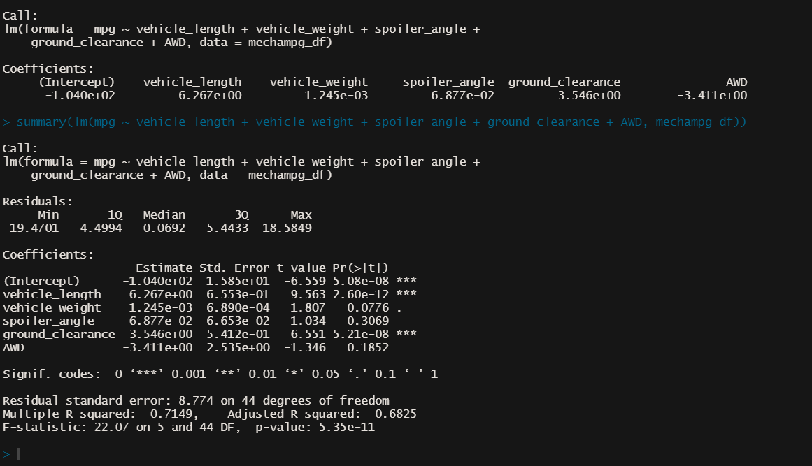
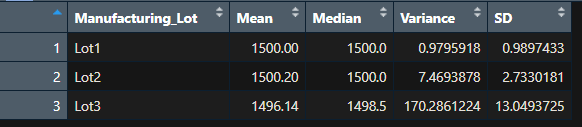
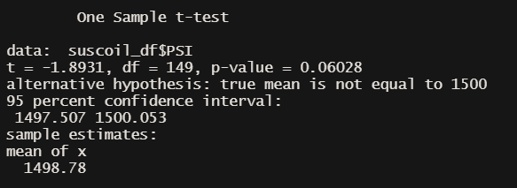
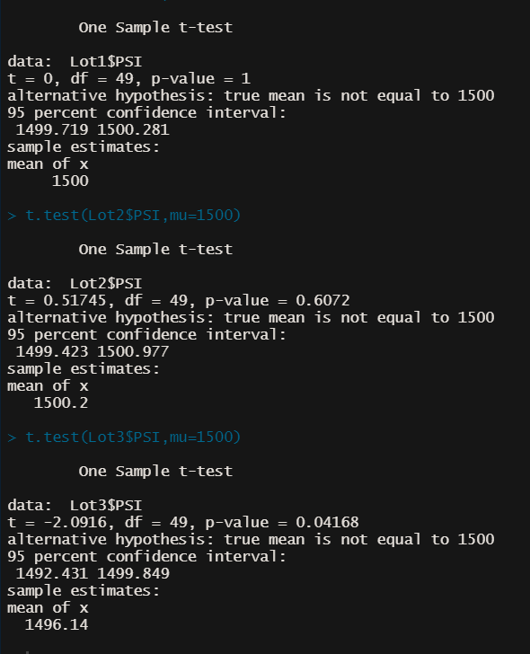

# Mechacar Statistical Analysis with R

    

## 
Utizlie R Review Vehicle Production Data for Actionable Insights

<a href="#goals">Goals</a> &nbsp;&bull;&nbsp;
<a href="#dataset">Dataset</a> &nbsp;&bull;&nbsp;
<a href="#tools-used">Tools Used</a> &nbsp;&bull;&nbsp;
<a href="#results">Results</a>

# 
Goals

With the power of R, our analytics team will assess vehicle production data to identify solutions to production issues. We plan on performing our analysis as follows:

- Perform multiple linear regression analysis to identify which variables in the dataset predict the mpg of MechaCar prototypes
- Collect summary statistics on the pounds per square inch (PSI) of the suspension coils from the manufacturing lots
- Run t-tests to determine if the manufacturing lots are statistically different from the mean population
- Design a statistical study to compare vehicle performance of the MechaCar vehicles against vehicles from other manufacturers

# 
Dataset

Our analysis will review two sets of data. The first dataset contains multiple metrics, such as vehicle length, vehicle weight, spoiler angle, drivetrain, and ground clearance, were collected for each vehicle. The second dataset, contains the weight capacities of multiple suspension coils were tested to determine if the manufacturing process is consistent across production lots.

- [Mechacar MPG Dataset:](data/MechaCar_mpg.csv) CSV that contains mpg test results for 50 prototype MechaCars, hosted in Amazon S3
- [Suspension Coil Dataset:](data/Suspension_Coil.csv) CSV that contains 150 rows of results from multiple production lots.

# 
Tools Used

- **R:** Programming language used for statistical modelling, hypothesis testing and implementing machine learning algorithms
    - **Tidyverse:** R package used to help simplify the process of creating transformed data columns, grouping data using factors, reshaping our two-dimensional data structures, and visualizing our results using plots
- **R Studio:** An integrated development environment used to help design and test RScripts

# 
Results

## Linear Regression to Predict MPG

According to our summary results, Vehicle Length and Ground clearance provided a non-random amount of variance to the mpg values in the dataset. In other words, these two variables had a significant impact on miles per gallon. The R-Squared value of .71, showing a high correlation between our dependent and independent variables. Coupled with our p-value of -5e-11 being significantly lower than 0.5 -indicating strong statistical significance- we can safely assume the slope of our linear model is not zero. Given the high correlation and statistically significant p-value, we believe this linear model effectively predicts mpg of Mechacar Prototypes.

## Summary Statistics on Suspension Coils

The design specifications for the MechaCar suspension coils dictate that the variance of the suspension coils must not exceed 100 pounds per square inch. According to our total summary above, the variance for all manufacturing falls beneath the 100 pound per square inch threshold. 

However, digging deeper into each lot, we're seeing that Production Lot 3 isn't producing coils that comply with design specifications. Consequently, we can only accept coils from lots 1 and 2, both producing with variance well below the max threshold.

## T-Tests on Suspension Coils

According to the above aggregate T Test, the p-value is above 0.05, indicating the overall mean PSI is statistically similar with the defined mean PSI of 1,500

The above T tests separated by lot paints a slightly different story. Lots 1 and 2  contain p-values significantly higher than 0.05, indicating strong statistical similarity between each lot's mean PSI and the 1,500 mean PSI. Lot 3's p-value came in lower than 0.5, indicating that the Mean PSI is not statistically similar to 1,500 mean PSI.

## Study Design: MechaCar vs Competition

We are designing a statistical study that can quantify how the MechaCar performs against the competition. In order to best inform our consumers, we are highlighting the Mechacar's superior gas mileage as a dependent variable, and horsepower as the independent variable. We're comparing these metrics to the competing leading American, European and Japanese Car Manufacturers. Below we will test the following Null and Alternative Hypotheses:

H0: If the amount of horsepower does not affect gas mileage, then increasing the amount of horsepower has no effect on gas mileage.
HA: If the amount of horsepower affects gas mileage, then increasing the amount of horsepower will reduce gas mileage.

In order to run a proper comparison between MechaCar and its competitors, we want to run a multiple line p-test. We want to test gas mileage for cars with >500 Horsepower across different manufacturers and compare to a mean of 30 miles per gallon. To accomplish this study, we will need the a data set with the following: Manufacturer, Vehicle Type, Horsepower and MPG. 

# 
Summary

[Back to top](#mechacar-statistical-analysis-with-r)
